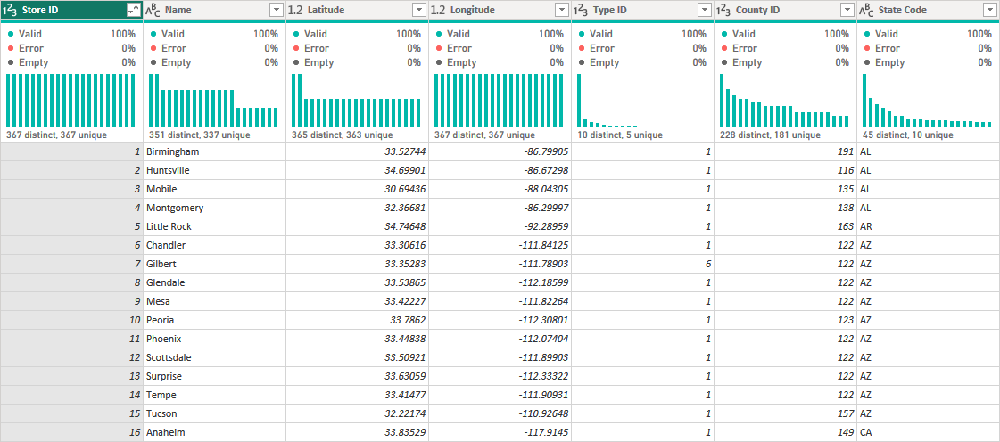
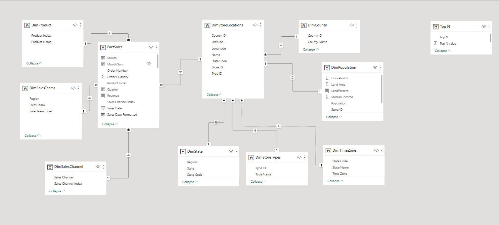

# Sales Performance Analysis

In this project, I have used the dataset `sale_data.xlxs` to process, build and visualize to show the business's sales performance. This report includes 3 pages and meets all the criteria about the status of the sales department:

- Understand the company's sales performance by sales channel, sales team, stores and items.
- Identify the areas with the highest and lowest sales and find out why?
- Identify the product with the highest and lowest sales and find out why?

<u>Note:</u> The data source in `SalesPerformanceReport.pbix` is got from the online version of `sale_data.xlxs`. Just open and you will be able to access all things from this report

## Dataset description

In the file `sale_data.xlxs`, there are 5 tables:

- **Sales table**: This table contains all the transactions by day, sales channel, stores and items
- **Regions**: This table contains information about all the states of the US and respective regions
- **Sales team**: This table contains information about sales team
- **Product**: This table contains information about the launched products
- **Store Locations**: This table contains information about the stores of this retail chain's stores.

Problem with this dataset:

- The names are not synchronized, the format is not consistent and the meaning is unclear.
- The FACT table here is the "Sales table", meaning that this table will contains many records. To optimize memory problems, we should change some foreign keys' types from `text` to `int`.

  For example, in the "Sales Channel" attribute, the use of `text` type to store thousands, millions of records will take a lot more memory than using an `int` ID for each sales channel.

- In the FACT table "Sales table", the current number of rows is more than 1 million lines, while only about 20 thousand lines have complete data about orders. Furthermore, some attributes in the table "Sales table" can be omitted, such as "Currency" since all values are in `USD`

## Clean and transform data

In this part, I will make use of `Power Query` inside `Power BI` to clean and tranform data

1. Sales Table -> FactSales

   - Format and rename data types
   - Replace the “Sales Channel” attribute with “Sales Channel Index” and create another “DimSalesChannel” table
   - Delete the “Currency” attribute

2. Sales team -> DimSalesTeams

   - Choose a random name to fill in the missing value of sales team with index 20

3. Store Locations -> DimStoreLocation

   - Although this is a DIM table that includes stores' information, the amount of attributes in this table is extremely large. That is why I decided to create more DIM tables from this one to benefit the visualization process later   
   

   | Separated tables | Primary Key | Remaining attributes                                                              |
   | ---------------- | ----------- | --------------------------------------------------------------------------------- |
   | DimPopulation    | StoreID     | Population   Households   Median   Income   Land Area   Water Area |
   | DimState         | Sate Code   | State   Region                                                                 |
   | DimCounty        | County ID   | County Name                                                                       |
   | DimStoreTypes    | Type ID     | Type Name                                                                         |

    

    
 <u>Table 1</u>: DimStoreLocation table 

   After separating and changing attributes from `text` to `whole number` ID respectively, DimStoreLocations will be like this:

   

## Build data model

The model building process will include 2 main steps:

### Step 1: Connect tables

<u>Figure 1</u>: _Star Schema_ connection

In the `Modelling` tab, I have linked the tables in the form of Star Schema, with the centre being the table "FactSales", which revolves around the DIM table including: "DimProduct", "DimSalesTeam", "DimSalesChannel" and "DimStoreLocation" is linked to the FACT table with a "One to Many" relationship.

### Step 2: Adding DAX formulas

1. Date Hierachy

Initially, in table FactSales, the "Sales Date" attribute was simply a `text` format with the date recorded in the format: `mm-dd-yyyy`. First, I will use some DAX functions to generate parts of the Date:

    - Month
    Month = FORMAT('FactSales'[Sales Date], "MMM")

    - Quarter
    Quarter = "Qtr"
            & IF (MONTH('FactSales'[Sales Date]) <=3, 1,
            IF (MONTH ('FactSales'[Sales Date]) <= 6, 2,
            IF (MONTH ('FactSales'[Sales Date]) <=9,3,4)))

    - Year
    Year = YEAR ('FactSales'[Sales Date])

    - Weekday
    Weekday = FORMAT(FactSales[Sales Date], "ddd")

After creating the components, I will concatenate them to form `Date Hierarchy`

2. Calculation

These are basic calculation measures using in my dashboard:

a) Basic calculation

    Average Deal Size = [Total Revenue]/[Total Transaction]
    ---------------------------------------------------------------------------------------------------------
    Profit Margin = DIVIDE([Total Profit], [Total Revenue])
    ---------------------------------------------------------------------------------------------------------
    Total Revenue = SUMX(FactSales,FactSales[Unit Price]*FactSales[Order Quantity])
    ---------------------------------------------------------------------------------------------------------
    Total Cost = SUMX(FactSales,FactSales[Unit Cost]*FactSales[Order Quantity])
    ---------------------------------------------------------------------------------------------------------
    Total Profit = SUMX(FactSales,FactSales[Unit Price]*FactSales[Order Quantity]) -
                   SUMX(FactSales,FactSales[Unit Cost]*FactSales[Order Quantity])
    ---------------------------------------------------------------------------------------------------------
    Total Transaction = COUNT(FactSales[Order Number])

b) Ranking

I will rank the revenue/profit by these attributes: _Product, Channel, Salesteam, State and Store_

For example: `Rank Revenue by SaleTeams =
RANKX(ALL('DimSalesTeams'[Sales Team]),[Total Revenue],,DESC)`

c) Time Intelligence:

    Profit MTD = TOTALMTD ([Total Profit], 'FactSales'[Sales Date])
    ---------------------------------------------------------------------------------------------------------
    Revenue MTD = TOTALMTD ([Total Revenue],'FactSales'[Sales Date])
    ---------------------------------------------------------------------------------------------------------
    Sales Prior Month = CALCULATE([Total Revenue],PREVIOUSMONTH(FactSales[Sales Date].[Date])
    ---------------------------------------------------------------------------------------------------------
    Sales MoM Growth =
        VAR SalesPriorMonth =
        CALCULATE (
            SUMX (FactSales, [Unit Price]*[Order Quantity]),
                PARALLELPERIOD('FactSales'[Sales Date].[Date], -1, MONTH)
        )
        RETURN
            DIVIDE (
                SUMX(FactSales,[Unit Price]*[Order Quantity])-SalesPriorMonth,SalesPriorMonth
            )
